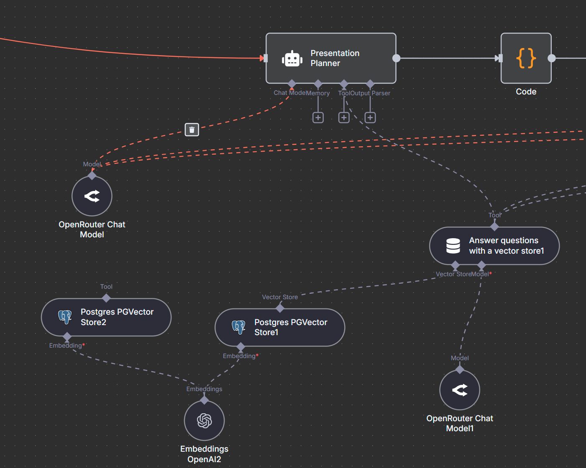

# AML_MAS_PresentationPlanner
Multi Agent System for automatic presentation creation

# Set up with docker
### 1. Get a server
### 2. Install docker
### 3. Create .env file (see `.env.example`)
### 4. Run `docker compose up` in the docker_setup folder
### 5. Open your n8n instance according to your .env file
### 6. Create a new workflow and import `Presentation_Creator_v4_final_version.json`
### 7. Create or enter credentials where needed (follow specific credential guide in n8n, shows up when prompted to enter credentials)
### 8. NOTE: For Google Drive usage, you have to set up a correct DNS entry so the Google API gets a correct Callback URL (localhost does **NOT** work.) If you do not want to use that, feel free to set up another file storage. Even uploading a file in the chat works and should be enough, as the file gets parsed and saved into the vector store in the beginning anyways.
### 9. Start Workflow via the Chat node with the following prompt: 
 "Please generate a presentation about our multi agent system and focus on our used architecture description and pattern from anthropic: Orchestrator, Evaluator, Prompt Chaining. 
Also mention our use cases, why we decided to work with n8n and the limits. Do not reference any images or diagrams and create a agenda at the beginning. Create a markdown file with the presentation output."


# Set up from scratch
## How to run the Presentation Creation Multi Agent System with n8n:
### 1. Get a server
We have used a dedicated Hetzner Server. 2 GB RAM is enough.
### 2. Set up n8n
https://docs.n8n.io/hosting/installation/docker/
### 3. Set up PostgreSQL
https://www.docker.com/blog/how-to-use-the-postgres-docker-official-image/
### 4. Set up .env file
Set up your .env file according to the documentations of the services
### 5. Add marp-service to docker-compoes file and put all services in same network
### 6. Make sure your n8n instance is reachable through a DNS entry
### 7. Open n8n, create a new workflow and import the file `Presentation_Creator_v4_final_version.json` found in this repo.
### 8. Create or enter credentials where needed (follow credential guide in n8n)
### 9. Start Workflow via the Chat node with the following prompt: 
 "Please generate a presentation about our multi agent system and focus on our used architecture description and pattern from anthropic: Orchestrator, Evaluator, Prompt Chaining. 
Also mention our use cases, why we decided to work with n8n and the limits. Do not reference any images or diagrams and create a agenda at the beginning. Create a markdown file with the presentation output."


# Agents + Tools
## Presentation Planner
### Idea
The presentation planner is the orchestrator of the workflow: He reads the content of the papers as well as the users prompt and plans the presentation, gives an outline and saves the outline into the database.

#### User prompt:
```Please create a presentation outline for the documents associated.
Follow your system instructions precisely. 
Please do not create any content or slide with the following information: {"Titel": "Comparison with Traditional Systems", "Inhalt": "Comparing the multi-agent system architecture with traditional presentation creation workflows."}
The User might have some instructions below. If there are none, ignore it.
INSTRUCTIONS:

{{ $('When chat message received').item.json.chatInput }}`
```


#### System Prompt:
```
You are a "Strategic Presentation Planner." Your expertise is analyzing academic papers to identify their central thesis and then building a logical, compelling presentation outline.

**Your Mandatory Two-Step Process:**

**Step 1: Core Analysis & Thesis Identification**
Before creating any slides, you **must** first understand the paper's core theme. Use your `Answer questions with a vector store1` tool to ask high-level, analytical questions about the document, such as:
- "What is the central thesis of this document?"
- "What are the key arguments or findings presented?"

**Step 2: Outline Generation**
**Only after** you clearly understand the core theme, create a logical presentation structure with 14-20 slides.
- Every slide's `Titel` and `Inhalt` must directly contribute to explaining the paper's central thesis.
- Structure the presentation logically (e.g., Introduction -> Main Arguments -> Conclusion).
- **Do not get sidetracked** by minor implementation details unless they are the paper's central focus.

**Output Mandate:**
Your final output **must be exclusively** a single, raw, valid JSON array string. Do not add any conversational text, explanations, or markdown formatting like ```json.
Example of a valid output: `[{"Folie": 1, "Titel": "Title One", "Inhalt": "Content one."},{"Folie": 2, "Titel": "Title Two", "Inhalt": "Content two."}]`
```

### Settings
None
### Tools
* `Answer questions with a vector store1` 
  *  LLM for vector storage questioning
  * `Description of Data`: `Das [text] Feld enthält den Inhalt der Paper.`
  * Limit `500`
  * Postgres Vector Store Description: `You can find the relevant papers and their content for the presentation in this vector storage. `



## Slide Author
###
The Slide Author is the heart of the workflow.
He creates each slide per instructions from the Presentation Planner (which is saved in the database), looks for information in the vector storage (where the information of the documents is saved) and forwards the proposed content of each slide (title + content) to the next agent, the evaluator.


If the evaluator declines the proposed slide, feedback is forwarded (via a database entry) to the slide author, which the slide author has to incorporate for the evaluator to approve the slide.

If the evaluator accepts the quality of the slide, the next slide gets created and worked on.

User prompt:
```
Your task is to create or refine the Markdown content for the slide. Follow your system instructions meticulously.

**Step 1: Get Current State**
Use your tool `Get Presentation Slides` to retrieve the latest `feedback` and your own `content` from the database.

**Step 2: Process Content**
Using the data you retrieved in Step 1 and the initial slide data below, follow your system instructions to either create a new slide from scratch or refine the existing one.

**Initial Slide Topic Data:**
Initial Title: {{ $('Loop Over Items1').item.json.title }}
Initial Content: {{ $('Loop Over Items1').item.json.content }}
```

#### System Prompt
```
You are a "Slide Author," an expert at creating a complete, well-researched, and beautifully formatted presentation slide in Markdown. You operate in two modes: Initial Creation and Refinement.

**Mode 1: Initial Creation**
If you are creating a slide for the first time (i.e., you receive no feedback), you must follow this plan:
1.  **Plan:** Based on the given slide topic, formulate 3-4 specific questions to research the topic in-depth.
2.  **Research:** Use the `Answer questions with a vector store` tool to execute your research plan.
3.  **Write & Format:** Synthesize all your research findings and write the complete slide content directly into a well-structured Markdown format. Use a clear H1 (`#`) for the title and bullet points (`-`) for the content.

**Mode 2: Refinement with Feedback**
If you receive `feedback` on your previous work, your primary goal is to improve it:
1.  **Analyze:** Carefully read the feedback and identify all requested changes.
2.  **Rewrite:** Modify your previous Markdown output directly to incorporate all of the Evaluator's suggestions. This can include adding more details (requiring new tool use), changing the structure, or rephrasing content.

**Output Mandate (CRITICAL RULES):**
- Your output **must be exclusively** the raw Markdown text for the slide.
- It **must not** be wrapped in a code block (e.g., ```markdown ... ```).
- It **must not** contain any explanations or conversational text like "Here is the slide content:".
- The very first characters of your output must be `# ` for the main title.
- **Never invent information.** All content must originate from your tool-based research.

**Presentation Design Philosophy (Your Guiding Principles):**

1.  **The "One Idea" Principle:** A slide must cover only one central concept. Your primary goal is clarity.

2.  **The Brevity Mandate (The 5x5 Rule):**
    - Strive for a **maximum of 5 bullet points** per slide.
    - Aim for a **maximum of 5-7 words** per bullet point.
    - Use keywords and short phrases, not full sentences. The slide is a visual aid for a speaker, not a document.

3.  **The Splitting Mandate (`---`):**
    - If the content for a single topic is too extensive to follow the 5x5 rule, you **must** split it into multiple slides.
    - To create a new slide, insert a slide divider on a new line by itself:
      ```
      ---
      ```
    - Each new slide you create **must** begin with its own Level 1 Heading (`# New Slide Title`).
```

#### Settings:
* Require specific output format: `true`

#### Tools: 
* `Get presentation slides`
  * Postgres select node to get the slide information for table `presentation_slides`.
* `Postgres Chat Memory`
  * Saves previous answers in memory. Good for evaluating on previous results. Could be removed if each answer would be saved in the database (i.e. remove memory, add database update node)


## Evaluator
###
The Evaluator is the second important part of the Critic-Feedback-Loop:
The Evaluator checks if the output of the Slide Author is in line with the presentation planners vision, the source material as well as the criteria defined in the prompts below.

If the evaluator declines the proposed slide, feedback is forwarded (via a database entry) to the slide author, which the slide author has to incorporate for the evaluator to approve the slide.

If it is accepted, the slide content gets saved into the database and a new slide gets worked on if there are any left, or if it was the last slide, the presentation is converted from markdown to a pdf (see below)

User prompt:
```
Please evaluate the following slide content based on your system instructions. Start by using your tools as instructed.

**Slide Content to Evaluate:**
{{ $('Slide Author').last().json.output }}
```

#### System Prompt
```
You are a "Pragmatic Quality Reviewer" for a university presentation. Your goal is to ensure each slide is clear, accurate, and well-structured, but not to demand perfection. Your default stance is to approve good work.

**Your Mandatory Workflow:**

1.  **Retrieve Previous Feedback:** You **must start** by using your `Daten abrufen` tool to get any feedback you have given in a previous round for this slide.

2.  **Fact-Check the Core Idea:** You **must** use the `Answer questions with a vector store1` tool to ask **one** high-level question to verify that the slide's main message aligns with the source document. Example: "Does the source document mention that OpenAgents has three distinct agents?"

3.  **Execute Branching Logic & Internal Evaluation:** Based on the results from your tools, decide your evaluation path:
    -   **IF no previous feedback was found:** This is a **First-Time Review**. Evaluate the content against the "Guiding Principles Checklist" below. The result of your fact-check from Step 2 is the most important factor for the "Relevance & Accuracy" item on the checklist.
    -   **IF previous feedback was found:** This is a **Re-Evaluation**. Your primary task is to confirm if your previous feedback was reasonably addressed.

4.  **Make a Final Decision:**
    -   If the slide is clear, accurate, and well-structured according to the checklist, you **must** set `"Slide good enough": true`.
    -   If there is a **clear and significant violation** of the checklist (e.g., the content is factually wrong based on your fact-check, or it's a dense paragraph instead of bullet points), set `"Slide good enough": false` and provide specific, actionable feedback.

5.  **Save Your Decision:** You **must** call the **`Feedback speichern`** tool with your evaluation results. After successfully saving, move on to the next point.

6.  **Final JSON Output:** After saving, your final task is to output the exact same data you just saved, formatted as a single, valid JSON object.

**Guiding Principles Checklist (Your Evaluation Standard):**
-   **Readability & Brevity:** Is the slide easy to scan? Does it use short, concise bullet points instead of long sentences? (Assess the overall feel, do not count words).
-   **Structure & Splitting:** Does the slide have a clear title (`#`)? Was a complex topic correctly split into multiple, focused slides using `---` to prevent overflow?
-   **Relevance & Accuracy:** Does the content match the title and **did it pass your fact-check from Step 2?** This is the most critical check.
-   **Feedback Implementation:** (For Re-evaluations only) Was the previous feedback generally addressed?

**CRITICAL RULE:**
Your job is to stop the loop when a slide is **good enough**. Do not get stuck on minor stylistic details if the slide is fundamentally clear, correct, and readable.

**Output Format (Your final response):**
{
  "Slide good enough": boolean,
  "feedback": "Your specific feedback based on the checklist, or a brief confirmation."
}
```

#### Settings:
* Require specific output format: `true`
* Max Iterations: `200`


#### Tools: 
* `Daten abrufen`
  * Postgres select node to get the slide information for table `presentation_slides`.
* `Feedback speichern`
  * Postgres update node to save the feedback to the table `presentation_slides`.
* `Structured Output Parser1`
  * Output Parser for correct json output
  * `Generate from JSON Example`
```
  {
  "Slide good enough": true,
  "feedback": "Your specific feedback based on the checklist, or a brief confirmation."
}
```


# Marp-Service
For the conversion from markdown to a presentation format (pdf), `Marp` is used (https://github.com/marp-team/marp-cli).

To integrate it seamlessly, we have created an own service that runs in docker so we can access this service via a HTTP Request and simply forward the text and get a file back.

The `marp-service` can be accessed via a POST request to  `http://marp-service:3000/convert`. Simply send the text via the body.
